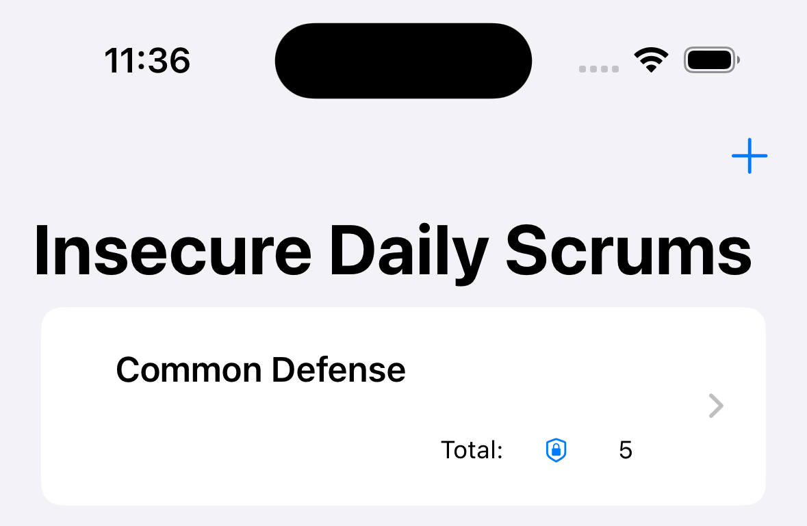
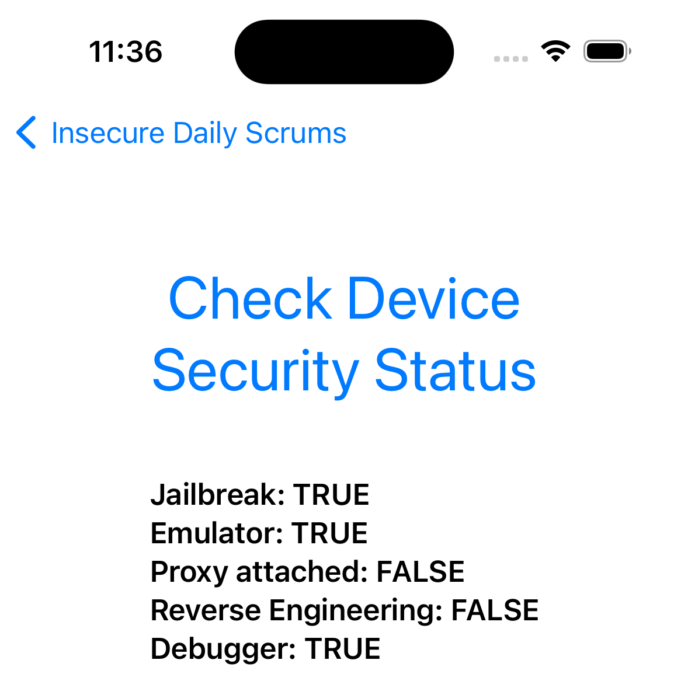

# shy

shy is a demo iOS application protected using IOSSecuritySuite library. The app was created to test new bypass methods for jailbreaking, tampering, debugging, emulation and more.

## Core

Homepage consists of a clickable card which showing the number of defense to be bypassed.

Check Device Status consists of a clickable button that shows the current security status of the phone. The goal is to bring all Boolean fields to FALSE by exploiting several bypass methods.

## Demo

Add GIF.

## Minimum requirements

At the moment shy supported only iOS 16.

## Installation

### Method 1

From **Releases** download shy ipa file. Sideloading it with tool like [Sideloadly](https://sideloadly.io/), [CydiaImpactor](http://www.cydiaimpactor.com/) and more.

### Method 2

With your Iphone, from **Releases** follow **download-shy** link, insert password and download app.

## Library Used for shy Project

[IOSSecuritySuite](https://github.com/securing/IOSSecuritySuite)
